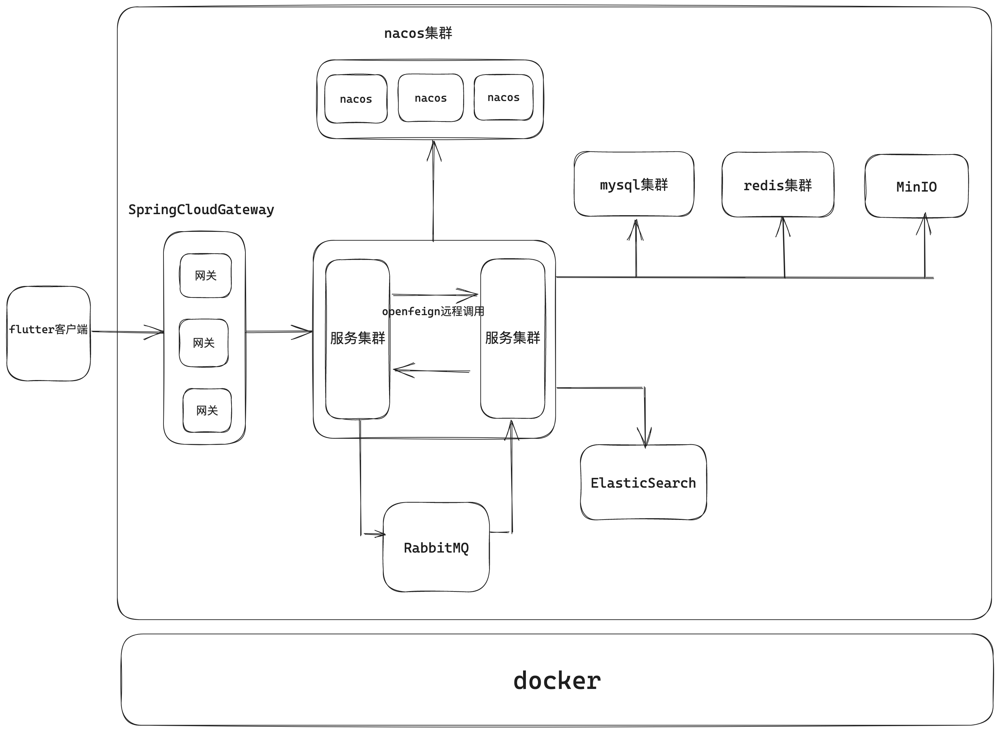

# DiliVideo-SpringCloud（更新中）

# 简介

一个从0实现的视频弹幕网站服务端。


## 技术栈：

| 技术               | 说明             |
| ------------------ | ---------------- |
| Spring-Boot        | 容器+MVC框架     |
| Mybatis-Plus       | ORM框架          |
| sa-token           | 认证和授权框架   |
| MySQL              | 关系型数据库     |
| Redis              | 分布式缓存       |
| RabbitMq           | 消息队列         |
| Nacos              | 注册与配置中心   |
| MinIO              | 对象存储         |
| SpringCloud        | 微服务框架       |
| SpringCloudAlibaba | 微服务框架       |
| Hutools            | 工具类           |
| ffmpeg             | 视频编辑         |
| docker             | 应用容器引擎     |
| Lombok             | 简化对象封装工具 |


## 开发工具

| 工具    | 说明             |
| ------- | ---------------- |
| IDEA    | 集成开发环境     |
| Navicat | 数据库可视化管理 |
| utools  | 开发工具         |
| Postman | 接口测试工具     |
| Tabby   | 终端模拟软件     |


## 架构图




## 组织结构

```
DiliVideo-SpringCloud
├── DiliVideo-Auth    -- 鉴权，登录，注册，与用户信息
├── DiliVideo-Barrage -- 弹幕服务（暂未完成）
├── DiliVideo-Base    -- 公用依赖
├── DiliVideo-CodeGen -- 生成的代码
├── DiliVideo-Content -- 媒体内容相关
├── DiliVideo-Feign   -- openFeign远程调用
├── DiliVideo-Gateway -- 网关
├── DiliVideo-Main    -- 评论，动态等内容
├── DiliVideo-Parent  -- 版本约束
└── DiliVideo-VideoEncode  -- 视频转码
 
```


